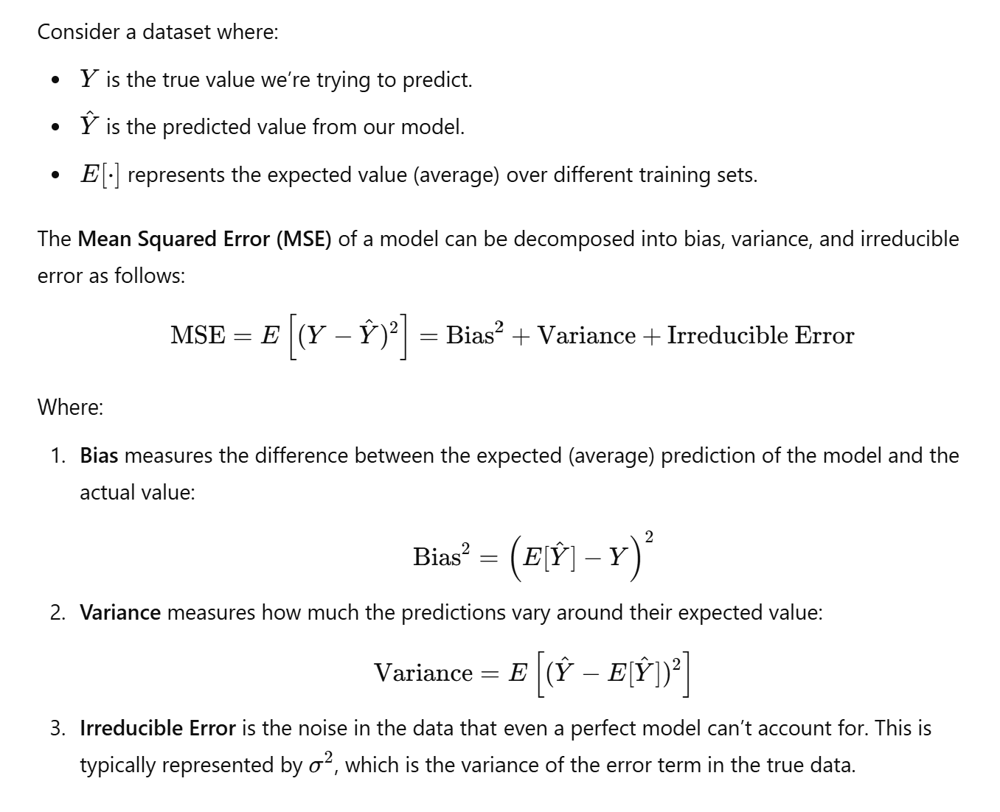
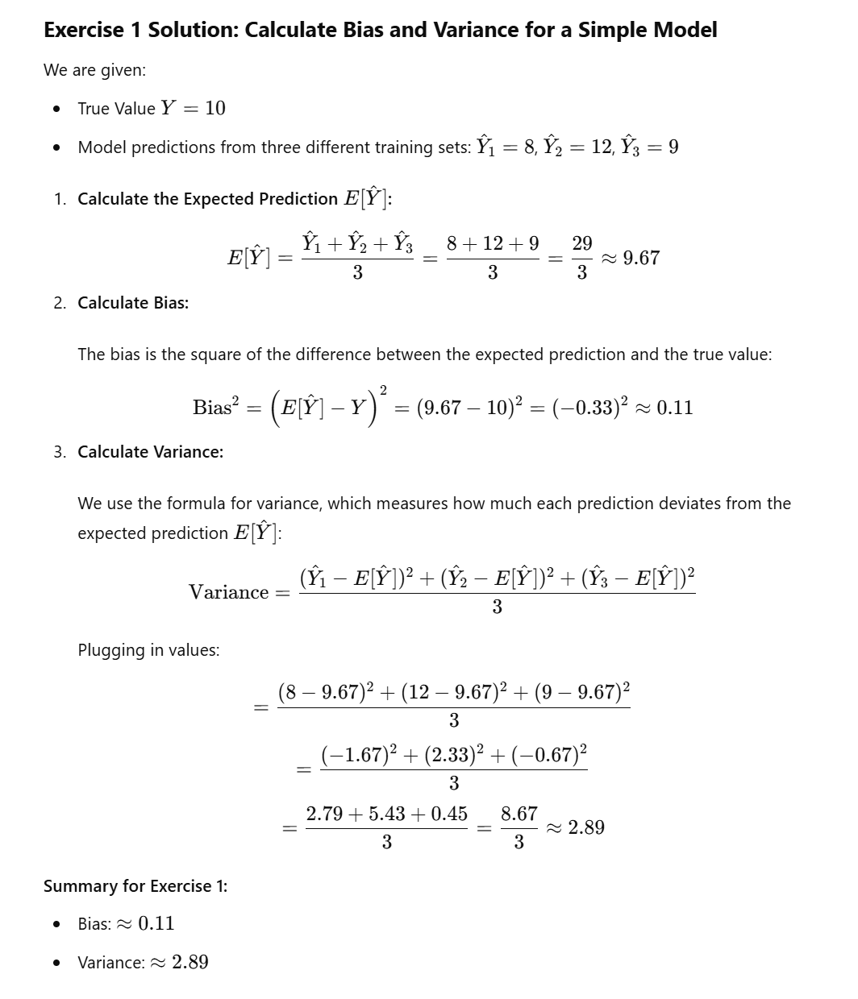

Bias is the inability of the model because of that there is some difference or error occurring between the model’s predicted value and the actual value.

Difference between actual or expected values and the predicted values are known as error or **bias** error

Bias is a systematic error that occurs due to wrong assumptions in the [machine learning](https://www.geeksforgeeks.org/machine-learning/) process.

It is the measurement of the model that how well it fits the data.

- ****Low Bias:**** Low bias value means fewer assumptions are taken to build the target function. In this case, the model will closely match the training dataset.
- ****High Bias:**** High bias value means more assumptions are taken to build the target function. In this case, the model will not match the training dataset closely.

High Bias = underfitting
High Variance = overfitting
Low Bias, Low Variance = Goodfitting

High Bias may have happened if you used very simple algorithms.
e.g Linear Regression model may have a high bias if the data has a non-linear relationship.

### Ways to reduce high bias in Machine Learning:
- ****Use a more complex model:**** We can use a more complex model like [Polynomial regression](https://www.geeksforgeeks.org/python-implementation-of-polynomial-regression/) for [non-linear datasets](https://www.geeksforgeeks.org/non-linear-regression-examples-ml/), [CNN](https://www.geeksforgeeks.org/introduction-convolution-neural-network/) for [image processing](https://www.geeksforgeeks.org/image-processing/), and [RNN](https://www.geeksforgeeks.org/introduction-to-recurrent-neural-network/) for sequence learning.
- ****Increase the number of features:**** By adding more features to train the dataset will increase the complexity of the model and its ability to capture the underlying patterns in the data.
- ****Reduce**** [****Regularization****](https://www.geeksforgeeks.org/regularization-in-machine-learning/) ****of the model:**** Regularization techniques can help to prevent [overfitting](https://www.geeksforgeeks.org/underfitting-and-overfitting-in-machine-learning/) and improve the generalization ability of the model. if the model has a high bias, reducing the strength of regularization or removing it altogether can help to improve its performance.
- ****Increase the size of the training data:**** Increasing the size of the training data can help to reduce bias by providing the model with more examples to learn from the dataset.

**Variance** is the measure of spread in data from its [mean](https://www.geeksforgeeks.org/mathematics-mean-variance-and-standard-deviation/) position.
**Variance** is the amount by which the performance of a predictive model changes when it is trained on different subsets of the training data. More specifically, variance is the variability of the model that how much it is sensitive to another subset of the training dataset. i.e. how much it can adjust on the new subset of the training dataset.

- ****Low variance:**** Low variance means that the model is less sensitive to changes in the training data and can produce consistent estimates of the target function with different subsets of data from the same [distribution](https://www.geeksforgeeks.org/introduction-of-statistical-data-distributions/). This is the case of underfitting when the model fails to generalize on both training and test data.
- ****High variance:**** High variance means that the model is very sensitive to changes in the training data and can result in significant changes in the estimate of the target function when trained on different subsets of data from the same distribution. This is the case of overfitting when the model performs well on the training data but poorly on new, unseen test data. It fits the training data too closely that it fails on the new training dataset.
### Ways to Reduce the reduce Variance in Machine Learning:

Cross-Validation
Feature selection: By choosing the only relevant feature will decrease the model’s complexity. and it can reduce the variance error.
- ****Simplifying the model:**** Reducing the complexity of the model, such as decreasing the number of parameters or layers in a neural network, can also help reduce variance and improve generalization performance.

- ****High Bias, Low Variance:**** A model with high bias and low variance is said to be underfitting.
- ****High Variance, Low Bias:**** A model with high variance and low bias is said to be overfitting.
- ****High-Bias, High-Variance:**** A model has both high bias and high variance, which means that the model is not able to capture the underlying patterns in the data (high bias) and is also too sensitive to changes in the training data (high variance). As a result, the model will produce inconsistent and inaccurate predictions on average.
- ****Low Bias, Low Variance:**** A model that has low bias and low variance means that the model is able to capture the underlying patterns in the data (low bias) and is not too sensitive to changes in the training data (low variance). This is the ideal scenario for a machine learning model, as it is able to generalize well to new, unseen data and produce consistent and accurate predictions. But in practice, it’s not possible.

| ****Machine Learning Algorithm****                                                 | ****Bias**** | ****Variance**** |
| ---------------------------------------------------------------------------------- | ------------ | ---------------- |
| [Linear Regression](https://www.geeksforgeeks.org/ml-linear-regression/)           | High Bias    | Less Variance    |
| [Decision Tree](https://www.geeksforgeeks.org/decision-tree/)                      | Low Bias     | High Variance    |
| [Random Forest](https://www.geeksforgeeks.org/random-forest-regression-in-python/) | Low Bias     | High Variance    |
| [Bagging](https://www.geeksforgeeks.org/bagging-vs-boosting-in-machine-learning/)  | Low Bias     | High Variance    |

### Why the Dataset Can Contribute to Bias
Limited Features or Simplified Data: 

- If the dataset lacks critical information (like the type of industry in which a customer works or their detailed spending habits), any model trained on this dataset will make biased predictions because it’s missing relevant details.
- For instance, without knowing if a customer works in a stable or unstable industry, the model might predict similar default rates for all employment statuses, leading to **high bias** due to oversimplified assumptions.

- If the data is old, it might not reflect recent economic changes, such as a recession or boom. For instance, if most of the dataset is from a time when default rates were low, the model may **underestimate the risk** of default in newer, riskier economic conditions.
- This makes the model biased because it doesn’t reflect the true, current patterns that influence loan default, leading to underfitting when applied to today’s economic context.

### Why the Dataset Can Contribute to Variance
**High Feature Complexity**:

- If the dataset contains many intricate, highly correlated features, a model might overfit by trying to capture every relationship. For example, certain combinations of income, credit score, and loan type might appear unique in the dataset, but may not generalize well.
- A highly complex model will have high variance, as it will react differently to new, unseen feature combinations that weren’t in the original training set.

**Noisy Data**:

- In real-world datasets, errors and inconsistencies often arise. For example, customer-reported income may vary, or credit scores might fluctuate due to temporary factors. This noise can cause a flexible model to “memorize” these minor variations.
- When applied to new customers, the model will predict inconsistently because it’s learned too many details that were specific to the original noisy dataset, leading to **high variance**.

**Small Sample Size or Lack of Diversity in Data**:

- If the dataset only includes a limited number of customers, or if it lacks diversity in terms of customer demographics or loan types, a model may end up overfitting to these specific cases.
- For instance, if the dataset only includes young borrowers, the model may perform inconsistently when predicting defaults for older customers, resulting in high variance due to the lack of generalizable patterns in the training data.

- **Dataset-driven Bias**: Comes from incomplete features, outdated or unrepresentative samples, and systematic errors in data collection, leading to an overly simplistic or skewed model.
- **Dataset-driven Variance**: Comes from noise, complex feature relationships, and limited sample size, making the model highly sensitive to variations in the data.

### Mathematical Formulas for Bias and Variance

Model B High Variance Low Low Bias
Low 
 