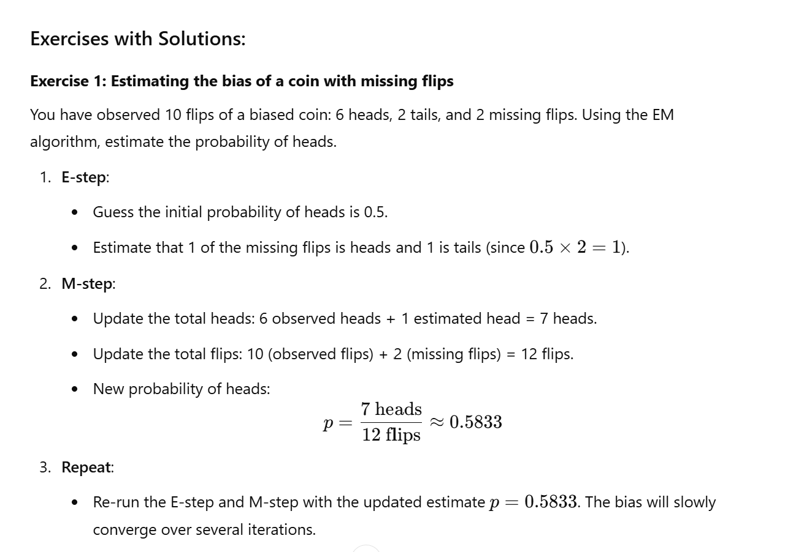

The **Expectation-Maximization (EM) algorithm** is a statistical method used for finding parameters of a model when the data is incomplete or has missing parts. It’s particularly useful for problems where we want to conclude hidden variables or deal with uncertainty in data.

- **Latent (Hidden) Variables**: These are variables that we cannot directly observe but influence the observed data. For example, imagine you are trying to classify whether a coin is biased based on the outcomes of flips, but you don't know the actual bias (probability of heads) of the coin directly.
    
- **Likelihood**: The likelihood is a function that describes how probable the observed data is given a set of parameters (for example, the bias of the coin).
    
- **Maximum Likelihood**: The goal of many machine learning algorithms is to maximize the likelihood — find the parameters that make the observed data most probable.

- **E-Step (Expectation)**: In this step, you use the current guess for the hidden variables to estimate their expected values. Essentially, you calculate how likely the hidden variables are given the observed data and current parameters.
    
- **M-Step (Maximization)**: In this step, you update the parameters of the model by maximizing the likelihood, based on the expected values of the hidden variables calculated in the E-step.

### **3. Missing Flips and Intuition Behind Estimating Heads/Tails**:

You're right to question the example of "missing flips." In a real experiment, it doesn’t make sense for flips to be missing — you would simply re-flip them. However, the **missing data** scenario in the EM algorithm doesn't necessarily mean that you physically missed the data. It refers to situations where, due to uncertainty or incomplete information, some data is unobservable or latent.

In our coin toss example, let's think of it differently: Suppose we don’t know the outcome of two flips because they were **unobserved** or **lost**. The EM algorithm allows us to estimate the **expected** outcome of these flips based on the known data and our current guess for the coin’s bias.

When we estimate the probability of the missing flips being heads or tails, we don’t say it will definitely be 1 head and 1 tail. Instead, we're **expecting** that, based on the observed flips, the missing flips will, on average, contribute 1 head and 1 tail. This expectation helps us refine our guess for the coin's bias (probability of heads).

- In the coin toss example, the missing flips were treated as latent (hidden) variables, and the EM algorithm helped us estimate the bias of the coin based on the observed data.
- The **0.0833 difference** in our estimate means the algorithm found the coin to be slightly biased, improving our guess from 0.5 (fair) to 0.5833.

### **2. Real-World Cases Where EM Can Be Beneficial**:

The **EM algorithm** is useful when you have **missing data** or **hidden variables** and want to estimate the parameters of a model. Here are some real-world examples:

- **Missing Data in Surveys**: In a survey where people report their income, some people may not answer certain questions (e.g., they skip reporting their income). Instead of discarding those people from the analysis, we can use the EM algorithm to estimate their missing responses based on other available information (age, occupation, etc.).
    
- **Customer Segmentation**: Suppose you want to segment customers into groups based on their purchasing behavior. The problem is, you don't know which customers belong to which segment. The EM algorithm can be used to estimate which customers belong to which group by modeling each group as a Gaussian distribution and iterating between estimating group memberships and updating the parameters of each group.
    
- **Image Segmentation**: In image analysis, an image may be a mixture of different regions (e.g., sky, mountains, water). If you want to separate the image into these regions but don’t know which pixel belongs to which region, the EM algorithm can help. Each region is modeled by a Gaussian, and the EM algorithm can be used to segment the image into different regions.

