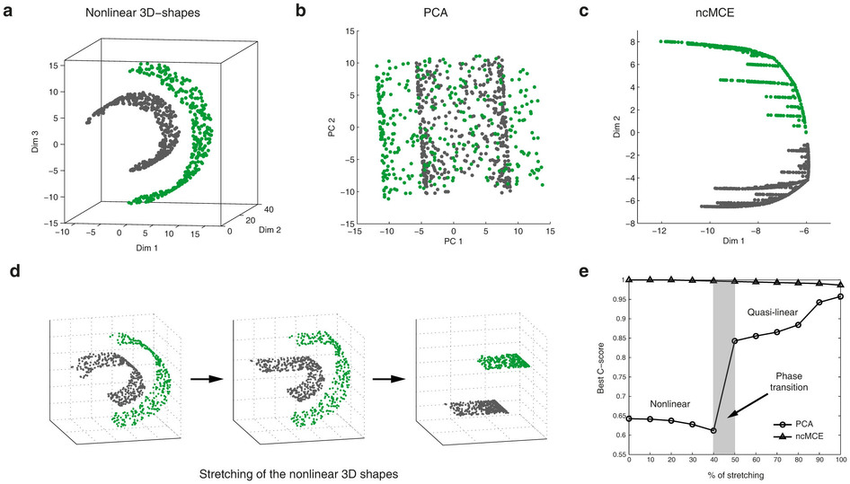

**Linear Data**
- - Each cluster can be easily separated by drawing boundaries around clusters in a roughly convex shape.
- The dataset might look like multiple blobs in space, where each blob is roughly circular and separated from the others by a visible gap.
- look like circular or slightly elliptical blobs.

**Non-Linear Data**
- **Spiral Patterns**: Data points may follow spiral paths, such as tracking a spiral-like movement or flow pattern in physics or biology.
    
- **Concentric Circles (Bullseye)**: Observed in many natural phenomena like radar signals, weather data, or even city layouts, where distances from a central point (like a city center) define a neighborhood.

- **Mall Customer Segmentation**:
    
    - **Type**: Linear
    - **Attributes**: Customer income, age, and spending score.
    - **Application**: Marketing, creating targeted ads, personalized recommendations.
- **Biological Data (DNA Microarray Data)**:
    
    - **Type**: Non-Linear
    - **Attributes**: Gene expression levels across different conditions.
    - **Application**: Clustering gene expression profiles where the genes might follow complex patterns, like spirals or loops due to gene regulatory networks.
- **Astronomical Data (Star Clustering)**:
    
    - **Type**: Non-Linear
    - **Attributes**: Coordinates in space, brightness, etc.
    - **Application**: Clustering stars or galaxies which might follow curved patterns in 3D space due to gravitational forces.

