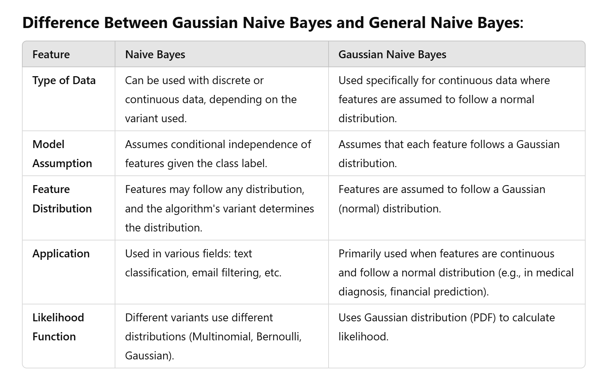

**Naive Bayes** is a family of probabilistic algorithms based on Bayes' Theorem. It is primarily used for classification tasks. The central assumption behind Naive Bayes is that the features used for classification are **independent** of each other, given the class label.
#### **Types of Naive Bayes:**

1. **Gaussian Naive Bayes**:
    
    - **Assumption**: The features (predictor variables) are assumed to follow a **Gaussian (Normal) distribution**.
    - This is typically used when the **input data** is continuous and follows a normal distribution.
    - In this case, the likelihood of each feature is calculated using the **probability density function** of the Gaussian distribution.
2. **Multinomial Naive Bayes**:
    
    - **Assumption**: Used when the features represent **count data** (e.g., word counts in text classification problems).
    - The features are assumed to follow a multinomial distribution, which is often applied in document classification or spam filtering tasks.
3. **Bernoulli Naive Bayes**:
    
    - **Assumption**: Used when features are binary (0 or 1).
    - The model assumes that the features follow a Bernoulli distribution, i.e., each feature is either present or not (like presence or absence of a word in a document).

x